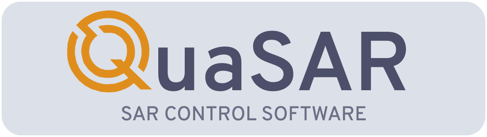

## Графический интерфейс для РЛС "Квазар"

         

 

## [Документация к проекту](https://whs31.github.io/quasar-software/index.html)

### Используемые технологии и стандарты
Приложение написано с использованием фреймворка **[QT](https://www.qt.io)** на языках С++ и QML.

<table>
<caption id="multi_row">Версия фреймворка и С++</caption>
<tr><th>Операционная система    <th>Минимальная версия QT  <th>Максимальная версия QT   <th>Минимальный стандарт C++   <th>Максимальный стандарт С++
<tr><td>Windows            </td><td>5.14.2            </td><td>6.6.0               </td><td>С++17                 </td><td>С++23 и выше          </td></tr>
<tr><td>Astra Linux 1.7    </td><td>5.11.0            </td><td>5.15.8              </td><td>С++14                 </td><td>С++17                 </td></tr>
<tr><td>Manjaro Linux      </td><td>5.15.8            </td><td>6.5.1+              </td><td>C++17                 </td><td>C++23 и выше          </td></tr>
<tr><td>Fedora Linux       </td><td>5.15.8            </td><td>6.5.0+              </td><td>C++17                 </td><td>C++23 и выше          </td></tr>
<tr><td>Android            </td><td>6.5.0             </td><td>6.6.0+              </td><td>C++17                 </td><td>C++20                 </td></tr>
</table>

### Поддержка платформ
На текущий момент приложение QuaSAR тестировалось на следующих системах:
<table>
<caption id="multi_row">Поддержка систем</caption>
<tr><th>Операционная система    <th>Поддерживается   <th>Последняя версия приложения   <th>Примечания
<tr><td>Windows 10         </td><td>Да          </td><td>2.13.0                   </td><td>                                                 </tr>
<tr><td>Windows 11         </td><td>Да          </td><td>2.13.0                   </td><td>                                                 </tr>
<tr><td>Astra Linux 1.6    </td><td>По запросу  </td><td>1.8.4                    </td><td>Требует сборки под стандарт C++14                </tr>
<tr><td>Astra Linux 1.7    </td><td>Да          </td><td>2.12.0                   </td><td>                                                 </tr>
<tr><td>Manjaro Linux      </td><td>Да          </td><td>2.13.0                   </td><td>                                                 </tr>
<tr><td>Fedora Linux       </td><td>Да          </td><td>2.12.0                   </td><td>                                                 </tr>
<tr><td>Ubuntu Linux       </td><td>Частично    </td><td>2.12.0                   </td><td>Не работает на версиях Ubuntu старше 21.10       </tr>
<tr><td>Android            </td><td>В разработке</td><td>2.12.0+                  </td><td>Находится в процессе разработки и тестирования   </tr>
</table>

### Стек
В проекте используются различные языки, фреймворки и сторонние библиотеки.
##### Языки
- **[C++](https://ru.wikipedia.org/wiki/C%2B%2B)** 17 стандарта и выше используется для внутренней логики приложения. Комплект разработчика QuasarSDK полностью написан на C++.
- **[QML](https://doc.qt.io/qt-6/qtqml-index.html)** используется для графического пользовательского интерфейса приложения и работы с OpenGL.
- **[CMake](https://cmake.org)** используется для сборки проекта.
- **[Python](https://www.python.org)** версии 3.10 используется для отладки и прототипирования.
- **[Rust](https://www.rust-lang.org)** пока не используется напрямую, однако, часть модулей во внутренней логике в перспективе будет перенесена на Rust.

##### Библиотеки
Основа проекта - библиотека и фреймворк **[QT](https://www.qt.io) версии 5.11 - 6.6.**

Прочие библиотеки, которые используются в проекте:
- **[Corrosion](https://github.com/corrosion-rs/corrosion)** используется для линковки между Rust и C++ составляющей.
- **[Argparse](https://github.com/cofyc/argparse)** используется для парсинга аргументов командной строки.

